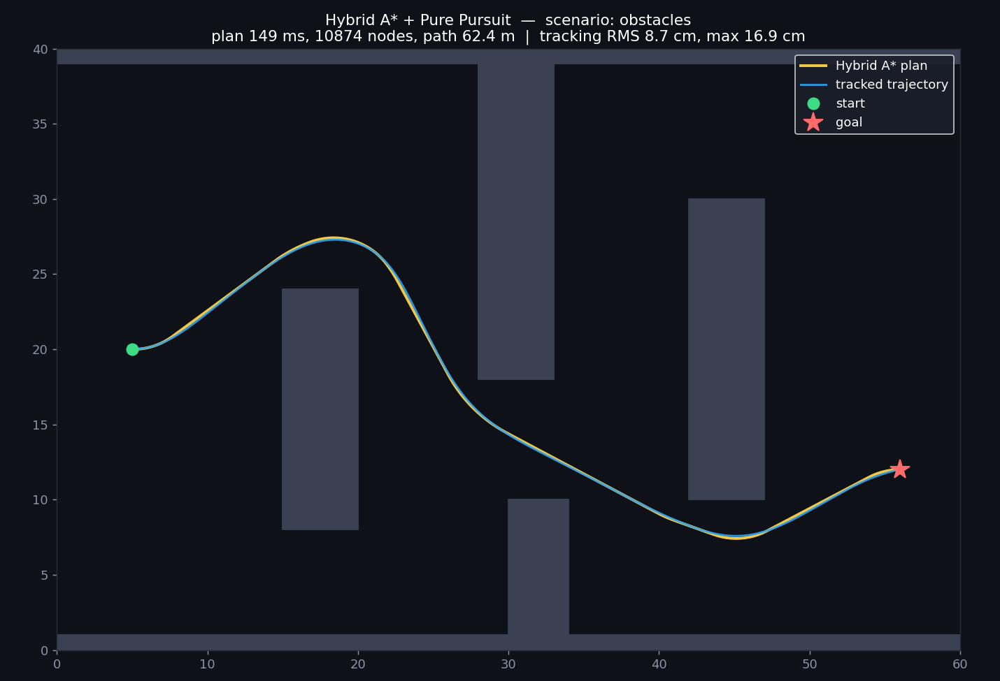
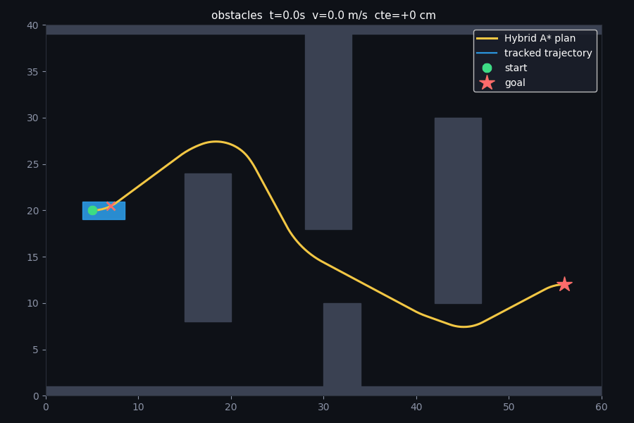
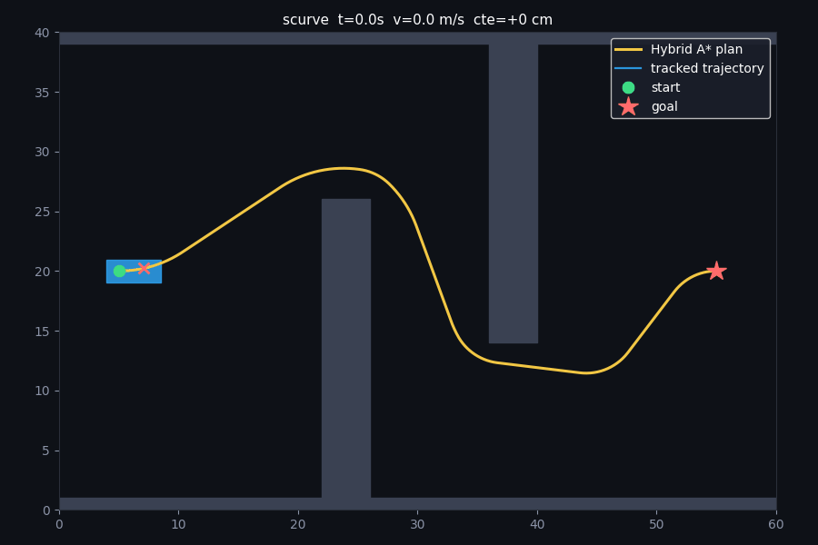

<h1 align="center">Hybrid A* Motion Planner</h1>

<p align="center">
  A kinematically-feasible motion planner and path-tracking controller for a
  car-like vehicle — the algorithm family used for real autonomous-vehicle
  low-speed maneuvering — implemented from scratch in C++ with a live browser demo.
</p>

<p align="center">
  
  
  
  
</p>

<p align="center">
  <b>▶ <a href="https://Jafar-97.github.io/hybrid-astar-planner/web/demo.html">Try the live interactive demo</a></b>
  &nbsp;·&nbsp; no install — draw obstacles, set a goal, watch it plan and drive
</p>

<p align="center">
  
</p>

---

## What it does

Given a start pose, a goal pose, and a map of obstacles, this plans a smooth,
drivable path and then tracks it in a closed-loop simulation:

<p align="center">
  
  
</p>

The planner is **Hybrid A\***, the search used for structured driving and parking
in real AV stacks (it debuted on Stanford's DARPA Urban Challenge entry). Unlike
grid A\*, every path it returns respects the car's turning radius, so it can
actually be driven.

## Results

Measured on the two built-in scenarios (single core, `-O2`):

| Scenario   | Plan time | Nodes expanded | Path length | Tracking RMS | Tracking max |
|------------|-----------|----------------|-------------|--------------|--------------|
| obstacles  | ~150 ms   | ~10,900        | 62.4 m      | **8.7 cm**   | 16.9 cm      |
| scurve     | ~370 ms   | ~26,500        | 65.4 m      | **9.4 cm**   | 20.4 cm      |

"Tracking RMS/max" is the cross-track error of the simulated vehicle against the
planned path — sub-10 cm means the plan is genuinely feasible and the controller
is well-tuned.

## How it works

**Planner — Hybrid A\*.** Search nodes are continuous vehicle states `(x, y, θ)`
expanded by integrating a bicycle model under a discrete set of steering actions,
so every edge is a real arc. Two ideas keep it fast:

- **Dual heuristic** `h = max(h_dubins, h_dijkstra)` — the Dubins distance
  (respects turning radius, ignores obstacles) combined with a Dijkstra field
  over the costmap (respects obstacles, ignores heading). Each covers the other's
  blind spot; the max stays admissible and prunes the tree hard.
- **Analytic Dubins expansion** — near the goal, the planner tries to connect
  straight to it with a single Dubins curve, finishing exactly on the goal pose.

**Controller — pure pursuit + PID.** A geometric look-ahead law steers the
vehicle onto the path; a PID regulates speed and eases off in sharp turns. The
planner and simulator share the *same* bicycle model, which is why a feasible
plan is actually trackable.

## Build & run

Requires a C++20 compiler and CMake ≥ 3.16.

```bash
cmake -S . -B build -DCMAKE_BUILD_TYPE=Release
cmake --build build -j

mkdir -p out
./build/planner_demo obstacles out      # or: scurve
python3 scripts/visualize.py out         # -> out/summary.png, out/demo.gif  (needs matplotlib, numpy, imageio)

ctest --test-dir build --output-on-failure
```

Or just `./run.sh obstacles`. For the web demo, open `web/demo.html` in a browser.

## Repository layout

```
include/ap/   public headers (vehicle, costmap, Dubins, planner, controller)
src/          implementations + demo driver (main.cpp)
tests/        dependency-free unit tests (Dubins + planner)
scripts/      visualize.py — renders summary PNG + animated GIF
examples/     pre-rendered results for both scenarios
web/          interactive browser demo (JavaScript port of the same algorithm)
DEFENSE_NOTES.md   design rationale and trade-offs
```

## Testing

`test_dubins` validates the closed-form Dubins solver by integrating every curve
back to its goal pose and checking length consistency. `test_planner` checks that
plans are found, are collision-free against the inflated map, end at the goal, and
never exceed the vehicle's curvature limit.

## Roadmap

- **Reeds–Shepp curves** for reverse motion (parallel parking, 3-point turns)
- Swept-polygon collision checking (tighter than the current disc footprint)
- Path smoothing (CHOMP-style) and a lateral **MPC** controller
- Time-indexed costmap for dynamic obstacles

## Notes

This is a clean-room implementation of a published algorithm (Hybrid A\*, Dolgov,
Thrun, Montemerlo & Diebel, 2008) with measured results — not production
autonomous-vehicle software. The `web/` demo is a JavaScript port of this C++
code; the C++ is the reference implementation.

## License

MIT — see `LICENSE`.
